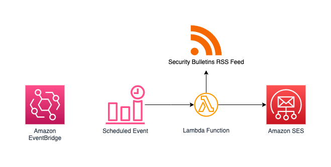

# AWS Automatic Security Bulletin E-Mail Alerts

This CDK project deploys an AWS Lambda Function which is scheduled for every full hour.
It checks the https://aws.amazon.com/security/security-bulletins for new AWS Security Bulletins and sends out E-Mail notifications via Amazon SES.

## Architecture

## Prerequisites
A verified identity in SES is needed.
See https://docs.aws.amazon.com/ses/latest/dg/creating-identities.html for detailed instructions

## Configuration
In `lib/cve-alert-stack` you can configure
* Line 15: `SES_RECEPIENTS` - list of recepients, comma seperated email addresses
* Line 16: `SES_SENDER` - sender email address, needs to be verified in SES
* Line 39: Event Schedule to trigger the lambda. Default every full hour. See https://docs.aws.amazon.com/cdk/api/v1/docs/@aws-cdk_aws-events.CronOptions.html

## Security considerations
By default, the Lambda Execution role is granted permissions to all SES identities in the current account. To follow the 'least privilege' best practice, it is recommended to limit it to the identity which is actually used. (In `lib/cve-alert-stack` line 33)

## Deployment
If your AWS account is not yet bootstrapped, run

    $ cdk bootstrap

To deploy the project, run

    $ cdk deploy

